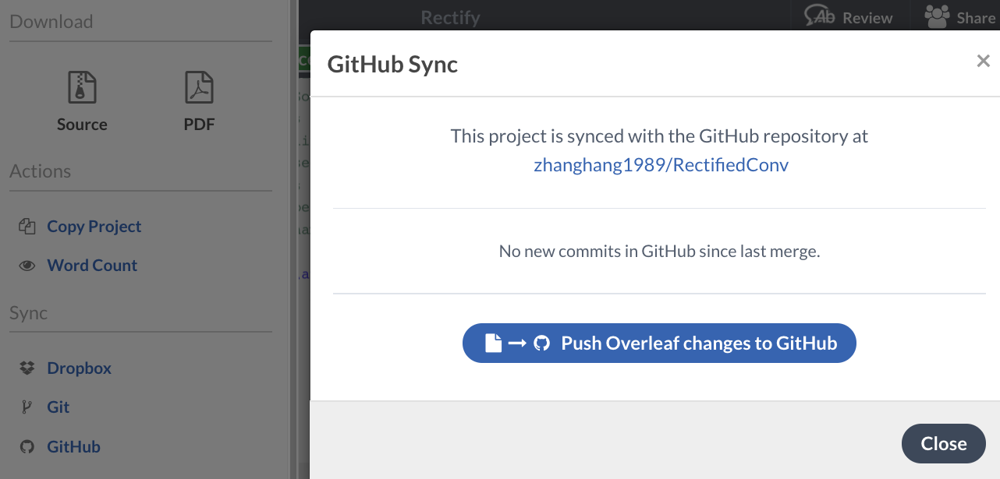

# Overleaf PDF Render && Pull Request Preview

Created by [Hang Zhang](https://hangzhang.org/).

This is an example project, which automatically render the PDF. Feel free to fork for you own purpose. 

1. Overleaf is very convenient for editing PDF file, but it does not provide PDF preview service. You can use this project to generate an auto updating PDF (synced with overleaf) and link it to your website (e.g. resume). [[Overleaf](https://www.overleaf.com/read/vjrwssthsjzp), [PDF](https://hangzhang.org/RectifiedConv/RectifiedConv.pdf)]
2. Some researchers enjoy using git to collaborate paper writting, but it is not straightforward to preview the PDF in a Pull Request. This project enables this feature. 

## Updating PDF

### Modify on Overleaf
You can easily modify the files and push it to GitHub using the built-in sync feature. The preview PDF will be automatically updated and renderred.

### Send A Pull Request
You may also send a pull request to this project, you can download the preview pdf from GitHub action.

